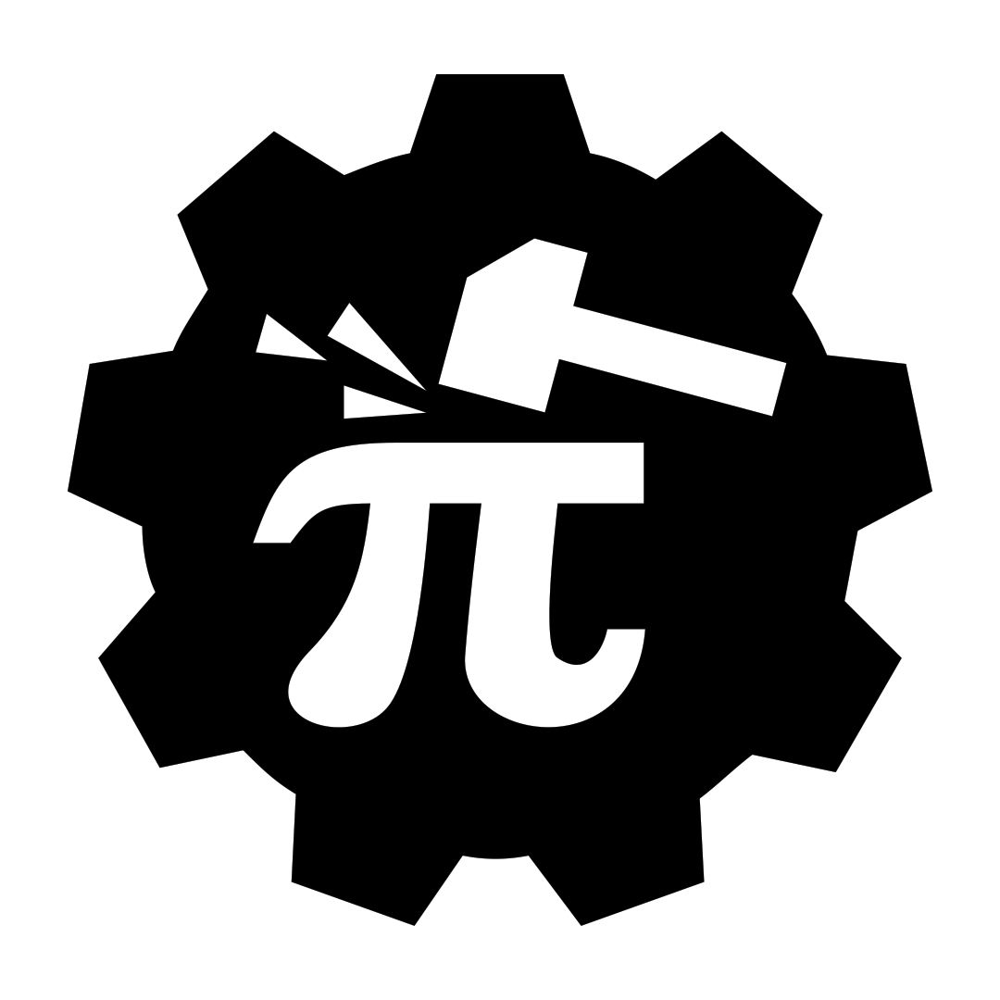

<link rel="shortcut icon" type="image/x-icon" href="{{ "/favicon.ico" | relative_url }}" >
<div class="title-container">
    
    <p><h1>arkworks</h1></p>
</div>

[`arkworks`](https://www.github.com/arkworks-rs) is a Rust ecosystem for zkSNARK programming.
Libraries in the `arkworks` ecosystem provide efficient implementations of all components required to implement zkSNARK applications, from generic finite fields to R1CS constraints for common functionalities.

## Getting started

Below are some resources for getting started working with `arkworks` crates:

* [Talk at Real World Crypto](https://youtu.be/Bz2KN_h3VKM?t=90) providing an overview of the `arkworks` ecosystem.
* [Tutorial for R1CS programming](https://github.com/arkworks-rs/r1cs-tutorial/) using the `ark-relations`, `ark-r1cs-std`, and `ark-crypto-primitives` crates.
* Quick introduction to using `arkworks`' algebra infrastructure:
    * [finite fields](https://github.com/arkworks-rs/algebra/blob/master/ff/README.md),
    * [elliptic curves and pairings](https://github.com/arkworks-rs/algebra/blob/master/ec/README.md), and
    * [serialization](https://github.com/arkworks-rs/algebra/blob/master/serialize/README.md).

## Getting Involved

We have a [Discord community](https://discord.gg/D9GjcxPt4R) where folks can ask questions and learn about zkSNARK programming. We also have a [Twitter](https://www.twitter.com/arkworks_rs) where we (infrequently) post updates.

## Index of useful repositories

### Working with SNARKs

* [snark](https://github.com/arkworks-rs/snark/tree/master/snark) - defines interfaces for a SNARK, for your application to generically use them
* [relations](https://github.com/arkworks-rs/snark/tree/master/relations) - defines interfaces for relations, e.g. r1cs, AIR

### SNARK proving systems

Fully packaged SNARK crates

* [groth16](https://github.com/arkworks-rs/groth16) - implementation of the Groth16 SNARK
* [marlin](https://github.com/arkworks-rs/marlin) - universal setup SNARK for r1cs
* [gm17](https://github.com/arkworks-rs/gm17)
* [gemini](https://github.com/arkworks-rs/gemini) - an elastic proof system for streaming inputs
* [ripp](https://github.com/arkworks-rs/ripp) - inner pairing product argument systems

### Circuit building

* [r1cs-std](https://github.com/arkworks-rs/r1cs-std)

### Algebra

* [finite fields](https://github.com/arkworks-rs/algebra/tree/master/ff)
* [elliptic curve models](https://github.com/arkworks-rs/algebra/tree/master/ec)
* [elliptic curve instantiations](https://github.com/arkworks-rs/algebra/tree/master/curves)
* [polynomials](https://github.com/arkworks-rs/algebra/tree/master/poly)

## Citation

If you use `arkworks` libraries in your research projects, please cite them using the following template:

```bibtex
@software{arkworks,
  author = {arkworks contributors},
  title = {\texttt{arkworks} zkSNARK ecosystem},
  url = {https://arkworks.rs},
  year = {2022},
}
```
